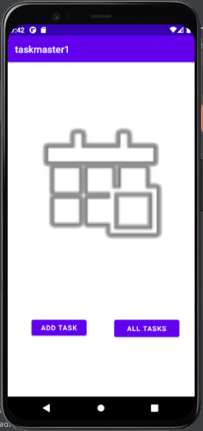
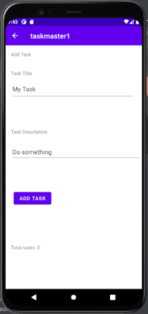
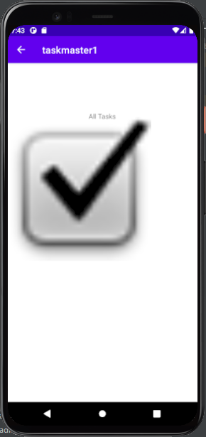

# Taskmaster Android App:

This App will contains tasks to do.. and you can add tasks and display your all tasks
There ara three main activities:

1. `MainActivity`: (The home page which from it you can go to add a new task or to see the all tasks)
2. `AddTaskActivity`: (The page which let you add a new task)
3. `AllTasksActivity`: (The page which displays the all tasks for you).

### _________________________________

***For first day changes (lab 26):***

* created the three activities and add the appropriate components inside them.
* connect them with the buttons in the MainActivity(Add Task, All Tasks).
* No functionalities yet, except the move on the activities using the previous two buttons

*Screenshots:*

MainActivity:

AddTaskActivity:

AllTasksActivity:

